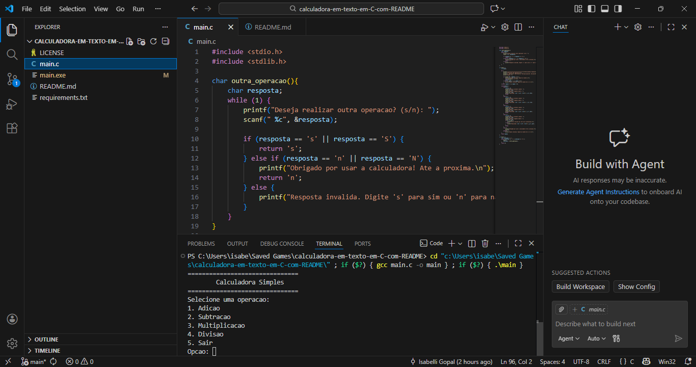

# Calculadora em texto em C

Um programa de calculadora baseado em texto que funciona inteiramente no terminal. A ideia é simples: ao rodar o programa, ele exibirá um menu de opções para o usuário, permitindo que escolha uma operação matemática como adição, subtração, multiplicação ou divisão. Depois, o usuário insere os números e recebe o resultado imediatamente. Prático.

## Instalação e Pré-requisitos

Para rodar o programa, você deverá instalar a IDE VSCode (ou usar IDEs online), instalar a extensão C/C++, instalar a ferramenta de compilação MinGW-w64 e instalar a extensão Code Runner. 
Para isso, aqui está o arquivo com todos os tutoriais de como fazer isso:

https://github.com/isagopal/calculadora-em-texto-em-C-com-README/blob/main/requirements.txt

Com tudo já instalado e pronto para utilizar a calculadora, você deve:
entrar no VSCode, escrever o comando '>Git: Clone' e colar o [link do projeto pelo GitHub](https://github.com/isagopal/calculadora-em-texto-em-C-com-README.git).

Feito isso, você deverá clicar no arquivo main.c na parte superior esquerda da tela do VSCode. Após isso, pressione Ctrl+Alt+N para rodar o programa da calculadora. A página do terminal abrirá na parte inferior central da tela.

## Uso e Exemplos de Comando

Para usar o programa corretamente, aqui vão algumas instruções sobre as funcionalidades!

Quando o programa for executado, ele deverá exibir um menu inicial com as seguintes opções:



Se o usuário não colocar um número válido (1, 2, 3, 4 ou 5), o programa imprimirá a seguinte mensagem de erro. Depois disso, perguntará se gostaria de fazer outra operação até que o usuário digite uma entrada válida:

```
Opcao invalida. Digite um numero de 1 a 5.
Deseja realizar outra operação? (s/n):
```

Se o usuário colocar uma opção que não seja um número (ex: caracteres), o programa imprimirá a seguinte mensagem de erro. Depois disso, perguntará se gostaria de fazer outra operação até que o usuário digite uma entrada válida:

```
Entrada invalida. Digite um numero.
```

Se o usuário escolher uma operação válida (por exemplo, "1" para adição), o programa deverá solicitar dois números:

No caso abaixo, os números escolhidos foram 5 e 3.
O programa imprimirá o resultado da operação escolhida.

```
Digite o primeiro número: 5
Digite o segundo número: 3
Resultado: 5 + 3 = 8
```

Após exibir o resultado, o programa perguntará se o usuário deseja realizar outra operação:

```
Deseja realizar outra operação? (s/n):
```

Se o usuário digitar "s", o programa volta ao menu inicial. Caso contrário, ele exibe uma mensagem de despedida e encerra:

```
Obrigado por usar a calculadora! Até a próxima.
```

Se o usuário não colocar uma resposta válida (s/S para sim e n/N para não), o programa dirá a mesma mensagem de erro. Depois disso, perguntará se gostaria de fazer outra operação até que receba uma entrada válida:

```
Resposta invalida. Digite 's' para sim ou 'n' para nao.
Deseja realizar outra operação? (s/n):
```

Caso o usuário tente dividir por zero, o programa dirá:

```
Erro: Divisao por zero nao e permitida.
```

E logo após, perguntará se gostaria de fazer outra operação.

```
Deseja realizar outra operação? (s/n):
```

Essas são as funcionalidades da nossa calculadora de texto em C que roda inteiramente no terminal!

## Estrutura do projeto
    
    ```
    calculadora-em-texto-em-C-com-README/  
    │── assets/  
    │   └── MENU-INICIAL.png    
    │── LICENSE
    │── main.c 
    │── README.md  
    └── requirements.txt
    ```

Acima temos a estrutura de diretórios e arquivos principais do projeto.
Cada arquio tem uma importância.

O arquivo LICENSE é importate pois contém a licença MIT do projeto.
O arquivo main.c é o código-fonte para usar a calculadora.
O arquivo README.md contém todas as instruções e funcionalidades sobre como usar a calculadora e basicamente todas as informações importantes em um só lugar.
E por último, o arquivo requirements.txt tem todos os tutoriais dos pré-requisitos para utilização da calculadora, como por exemplo instalar IDEs, extensões e compiladores.

### Licença do projeto

Aqui está o [link da licença de nosso projeto](https://github.com/isagopal/calculadora-em-texto-em-C-com-README/blob/main/LICENSE).